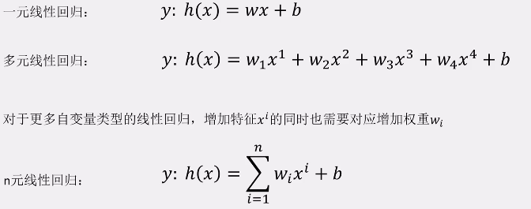

## 目录
- [1.题目](#1题目)

- [2.步骤](#2步骤)

- [3.模型选择](#3模型选择)

- [4.环境配置](#4环境配置)

- [5.csv数据处理](#5csv数据处理)

- [6.数据处理](#6数据处理)

  

  - 房价预测模型时的python代码
  - 基于sklearn

## 1.题目：
&nbsp;&nbsp;&nbsp;&nbsp;&nbsp;&nbsp;&nbsp;&nbsp;从给定的房屋基本信息以及房屋销售信息等，建立一个回归模型预测房屋的销售价格。

- **数据说明**：
数据主要包括2014年5月至2015年5月美国King County的房屋销售价格以及房屋的基本信息。
数据分为训练数据和测试数据，分别保存在kc_train.csv和kc_test.csv两个文件中。
其中训练数据主要包括10000条记录，14个字段，主要字段说明如下：
第一列“销售日期”：2014年5月到2015年5月房屋出售时的日期
第二列“销售价格”：房屋交易价格，单位为美元，是目标预测值
第三列“卧室数”：房屋中的卧室数目
第四列“浴室数”：房屋中的浴室数目
第五列“房屋面积”：房屋里的生活面积
第六列“停车面积”：停车坪的面积
第七列“楼层数”：房屋的楼层数
第八列“房屋评分”：King County房屋评分系统对房屋的总体评分
第九列“建筑面积”：除了地下室之外的房屋建筑面积
第十列“地下室面积”：地下室的面积
第十一列“建筑年份”：房屋建成的年份
第十二列“修复年份”：房屋上次修复的年份
第十三列"纬度"：房屋所在纬度
第十四列“经度”：房屋所在经度

&nbsp;&nbsp;&nbsp;&nbsp;&nbsp;&nbsp;&nbsp;&nbsp;测试数据主要包括3000条记录，13个字段，跟训练数据的不同是测试数据并不包括房屋销售价格，学员需要通过由训练数据所建立的模型以及所给的测试数据，得出测试数据相应的房屋销售价格预测值。

## 2.步骤


- 1.选择合适的模型，对模型的好坏进行评估和选择。
- 2.对缺失的值进行补齐操作，可以使用均值的方式补齐数据，使得准确度更高。
- 3.数据的取值一般跟属性有关系，但世界万物的属性是很多的，有些值小，但不代表不重要，所有为了提高预测的准确度，统一数据维度进行计算，方法有特征缩放和归一法等。
- 4.数据处理好之后就可以进行调用模型库进行训练了。
- 5.使用测试数据进行目标函数预测输出，观察结果是否符合预期。或者通过画出对比函数进行结果线条对比。

## 3.模型选择
这里我们选择多元线性回归模型。公式如下：选择多元线性回归模型。


y表示我们要求的销售价格，x表示特征值。需要调用sklearn库来进行训练。


## 4.环境配置
- python3.5
- numpy库
- pandas库
- matplotlib库进行画图
- seaborn库
- sklearn库

## 5.csv数据处理
下载的是两个数据文件，一个是真实数据，一个是测试数据，打开*kc_train.csv*，能够看到第二列是销售价格，而我们要预测的就是销售价格，所以在训练过程中是不需要销售价格的，把第二列删除掉，新建一个csv文件存放销售价格这一列，作为后面的结果对比。

## 6.数据处理
首先先读取数据，查看数据是否存在缺失值，然后进行特征缩放统一数据维度。代码如下：(注：最后会给出完整代码)
```python
#读取数据
housing = pd.read_csv('kc_train.csv')
target=pd.read_csv('kc_train2.csv')  #销售价格
t=pd.read_csv('kc_test.csv')         #测试数据

#数据预处理
housing.info()    #查看是否有缺失值

#特征缩放
from sklearn.preprocessing import MinMaxScaler
minmax_scaler=MinMaxScaler()
minmax_scaler.fit(housing)   #进行内部拟合，内部参数会发生变化
scaler_housing=minmax_scaler.transform(housing)
scaler_housing=pd.DataFrame(scaler_housing,columns=housing.columns)
```

## 7.模型训练
使用sklearn库的线性回归函数进行调用训练。梯度下降法获得误差最小值。最后使用均方误差法来评价模型的好坏程度，并画图进行比较。
```python
#选择基于梯度下降的线性回归模型
from sklearn.linear_model import LinearRegression
LR_reg=LinearRegression()
#进行拟合
LR_reg.fit(scaler_housing,target)


#使用均方误差用于评价模型好坏
from sklearn.metrics import mean_squared_error
preds=LR_reg.predict(scaler_housing)   #输入数据进行预测得到结果
mse=mean_squared_error(preds,target)   #使用均方误差来评价模型好坏，可以输出mse进行查看评价值

#绘图进行比较
plot.figure(figsize=(10,7))       #画布大小
num=100
x=np.arange(1,num+1)              #取100个点进行比较
plot.plot(x,target[:num],label='target')      #目标取值
plot.plot(x,preds[:num],label='preds')        #预测取值
plot.legend(loc='upper right')  #线条显示位置
plot.show()
```
最后输出的图是这样的：

从这张结果对比图中就可以看出模型是否得到精确的目标函数，是否能够精确预测房价。

- 如果想要预测test文件里的数据，那就把test文件里的数据进行读取，并且进行特征缩放，调用：
**LR_reg.predict(test)**
就可以得到预测结果，并进行输出操作。
- 到这里可以看到机器学习也不是不能够学会，只要深入研究和总结，就能够找到学习的方法，重要的是总结，最后就是调用一些机器学习的方法库就行了，当然这只是入门级的，我觉得入门级的写到这已经足够了，很多人都能够看得懂，代码量不多。但要理解线性回归的概念性东西还是要多看资料。

