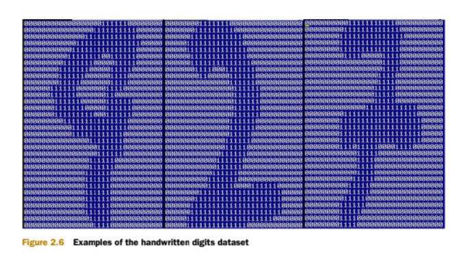

### 项目案例: 手写数字识别系统

#### 项目概述

构造一个能识别数字 0 到 9 的基于 KNN 分类器的手写数字识别系统。

需要识别的数字是存储在文本文件中的具有相同的色彩和大小：宽高是 32 像素 * 32 像素的黑白图像。

#### 开发流程

```
收集数据：提供文本文件。
准备数据：编写函数 img2vector(), 将图像格式转换为分类器使用的向量格式
分析数据：在 Python 命令提示符中检查数据，确保它符合要求
训练算法：此步骤不适用于 KNN
测试算法：编写函数使用提供的部分数据集作为测试样本，测试样本与非测试样本的
         区别在于测试样本是已经完成分类的数据，如果预测分类与实际类别不同，
         则标记为一个错误
使用算法：本例没有完成此步骤，若你感兴趣可以构建完整的应用程序，从图像中提取
         数字，并完成数字识别，美国的邮件分拣系统就是一个实际运行的类似系统
```

> 收集数据: 提供文本文件

压缩包trainingDigits.zip中包含了大约 2000 个例子，每个例子内容如下图所示，每个数字大约有 200 个样本；目录 [testDigits] 中包含了大约 900 个测试数据。



> 准备数据: 编写函数 img2vector(), 将图像文本数据转换为分类器使用的向量

将图像文本数据转换为向量

```python
def img2vector(filename):
    returnVect = zeros((1,1024))
    fr = open(filename)
    for i in range(32):
        lineStr = fr.readline()
        for j in range(32):
            returnVect[0,32*i+j] = int(lineStr[j])
    return returnVect
```

> 分析数据：在 Python 命令提示符中检查数据，确保它符合要求

在 Python 命令行中输入下列命令测试 img2vector 函数，然后与文本编辑器打开的文件进行比较: 

```python
>>> testVector = kNN.img2vector('testDigits/0_13.txt')
>>> testVector[0,0:32]
array([0., 0., 0., 0., 0., 0., 0., 0., 0., 0., 0., 0., 0., 0., 1., 1., 1., 1., 0., 0., 0., 0., 0., 0., 0., 0., 0., 0., 0., 0., 0.])
>>> testVector[0,32:64]
array([0., 0., 0., 0., 0., 0., 0., 0., 0., 0., 0., 0., 1., 1., 1., 1., 1., 1., 1., 0., 0., 0., 0., 0., 0., 0., 0., 0., 0., 0., 0.])
```

> 训练算法：此步骤不适用于 KNN

因为测试数据每一次都要与全量的训练数据进行比较，所以这个过程是没有必要的。

> 测试算法：编写函数使用提供的部分数据集作为测试样本，如果预测分类与实际类别不同，则标记为一个错误

```python
def handwritingClassTest():
    # 1. 导入训练数据
    hwLabels = []
    trainingFileList = listdir('data/2.KNN/trainingDigits')  # load the training set
    m = len(trainingFileList)
    trainingMat = zeros((m, 1024))
    # hwLabels存储0～9对应的index位置， trainingMat存放的每个位置对应的图片向量
    for i in range(m):
        fileNameStr = trainingFileList[i]
        fileStr = fileNameStr.split('.')[0]  # take off .txt
        classNumStr = int(fileStr.split('_')[0])
        hwLabels.append(classNumStr)
        # 将 32*32的矩阵->1*1024的矩阵
        trainingMat[i, :] = img2vector('data/2.KNN/trainingDigits/%s' % fileNameStr)

    # 2. 导入测试数据
    testFileList = listdir('data/2.KNN/testDigits')  # iterate through the test set
    errorCount = 0.0
    mTest = len(testFileList)
    for i in range(mTest):
        fileNameStr = testFileList[i]
        fileStr = fileNameStr.split('.')[0]  # take off .txt
        classNumStr = int(fileStr.split('_')[0])
        vectorUnderTest = img2vector('data/2.KNN/testDigits/%s' % fileNameStr)
        classifierResult = classify0(vectorUnderTest, trainingMat, hwLabels, 3)
        print "the classifier came back with: %d, the real answer is: %d" % (classifierResult, classNumStr)
        if (classifierResult != classNumStr): errorCount += 1.0
    print "\nthe total number of errors is: %d" % errorCount
    print "\nthe total error rate is: %f" % (errorCount / float(mTest))
```
